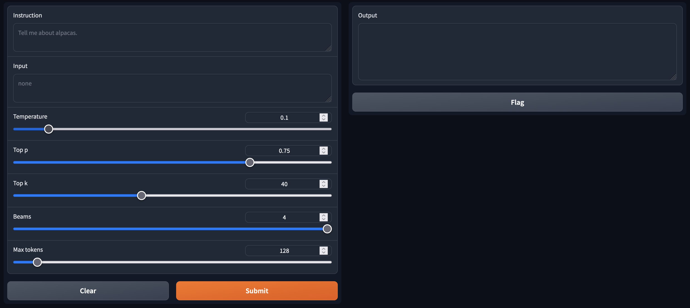

# LLaMA (Large Language Model Meta AI)

This repository assumes that you have already found a way to download the checkpoints and tokenizer for [LLaMA](https://github.com/facebookresearch/llama) (e.g., by filling out this [google form](https://forms.gle/jk851eBVbX1m5TAv5)). You should create a subdirectory (named ```LLaMA```) within this repository having a structure similar to the following tree.

```bash
LLaMA
├── 13B
│   ├── checklist.chk
│   ├── consolidated.00.pth
│   ├── consolidated.01.pth
│   └── params.json
├── 30B
│   ├── checklist.chk
│   ├── consolidated.00.pth
│   ├── consolidated.01.pth
│   ├── consolidated.02.pth
│   ├── consolidated.03.pth
│   └── params.json
├── 65B
│   ├── checklist.chk
│   ├── consolidated.00.pth
│   ├── consolidated.01.pth
│   ├── consolidated.02.pth
│   ├── consolidated.03.pth
│   ├── consolidated.04.pth
│   ├── consolidated.05.pth
│   ├── consolidated.06.pth
│   ├── consolidated.07.pth
│   └── params.json
├── 7B
│   ├── checklist.chk
│   ├── consolidated.00.pth
│   └── params.json
├── llama.sh
├── tokenizer_checklist.chk
└── tokenizer.model

4 directories, 26 files
```

Clone the [LLaMA](https://github.com/facebookresearch/llama) repository to make sure that everything works as expected.

```bash
git clone https://github.com/facebookresearch/llama.git
```

The LLaMA repository is already included here for reproducibility purposes in the folder named ```llama```. You can now run the following commands.

```bash
cd llama

torchrun --nproc_per_node 1 example.py --ckpt_dir ../LLaMA/7B --tokenizer_path ../LLaMA/tokenizer.model
```


# Converting LLaMA to Hugging Face

Create an empty directory within this repository called ```LLaMA_HF```. The following two scripts will then help you convert the LLaMA checkpoints and tokenizer to the Hugging Face format. 

```
convert_llama_tokenizer_to_hf.ipynb
convert_llama_weights_to_hf.ipynb
```

These two scripts are simplied versions of [convert_llama_weights_to_hf.py](https://github.com/huggingface/transformers/blob/main/src/transformers/models/llama/convert_llama_weights_to_hf.py) for pedagogical purposes.

This should result in a subdirectory (named ```LLaMA_HF```) within this repository having a structure similar to the following tree.

```bash
LaMA_HF
├── config.json
├── generation_config.json
├── pytorch_model-00001-of-00002.bin
├── pytorch_model-00002-of-00002.bin
├── pytorch_model.bin.index.json
├── special_tokens_map.json
├── tokenizer_config.json
└── tokenizer.model
```

# Exploratory Data Analysis

Clone the [Alpaca-LoRA](https://github.com/tloen/alpaca-lora) repository.

```bash
git clone https://github.com/tloen/alpaca-lora.git
```

The Alpaca-LoRA repository is already included here for reproducibility purposes in the folder named ```alpaca-lora```. Within this folder, there is a file called ```alpaca_data_cleaned.json```. This file contains a cleaned and curated version of the dataset used to train the original [Alpaca](https://github.com/tatsu-lab/stanford_alpaca). The following script will help you explore this dataset and build some intuition.

```
exploratory_data_analysis.ipynb
```

# Fine Tuning

You can now use the following commands to finetune the LLaMA model on the ```alpaca_data_cleaned.json``` dataset.

```bash
cd alpaca-lora

mkdir output

WORLD_SIZE=4 CUDA_VISIBLE_DEVICES=0,1,2,3 torchrun --nproc_per_node=4 --master_port=1234 finetune.py --base_model ../LLaMA_HF --data_path alpaca_data_cleaned.json --output_dir output
```

The command given above works for a machine with 4 GPUs. You should adjust it according to your own setup.

Once the finetuning process is finished, it will write the model artifacts in a folder called ```output```.

```bash
alpaca-lora/output/
├── adapter_config.json
├── adapter_model.bin
├── checkpoint-1000
│   ├── optimizer.pt
│   ├── pytorch_model.bin
│   ├── rng_state_0.pth
│   ├── rng_state_1.pth
│   ├── rng_state_2.pth
│   ├── rng_state_3.pth
│   ├── scaler.pt
│   ├── scheduler.pt
│   ├── trainer_state.json
│   └── training_args.bin
├── checkpoint-600
│   ├── optimizer.pt
│   ├── pytorch_model.bin
│   ├── rng_state_0.pth
│   ├── rng_state_1.pth
│   ├── rng_state_2.pth
│   ├── rng_state_3.pth
│   ├── scaler.pt
│   ├── scheduler.pt
│   ├── trainer_state.json
│   └── training_args.bin
└── checkpoint-800
    ├── optimizer.pt
    ├── pytorch_model.bin
    ├── rng_state_0.pth
    ├── rng_state_1.pth
    ├── rng_state_2.pth
    ├── rng_state_3.pth
    ├── scaler.pt
    ├── scheduler.pt
    ├── trainer_state.json
    └── training_args.bin

3 directories, 32 files
```

# Generating Text

Here is how you can interact with the finetuned model.

```bash
python generate.py --load_8bit --base_model ../LLaMA_HF --lora_weights output --share_gradio False
```

The final screen hosted on http://0.0.0.0:7860 will look like the following image.

